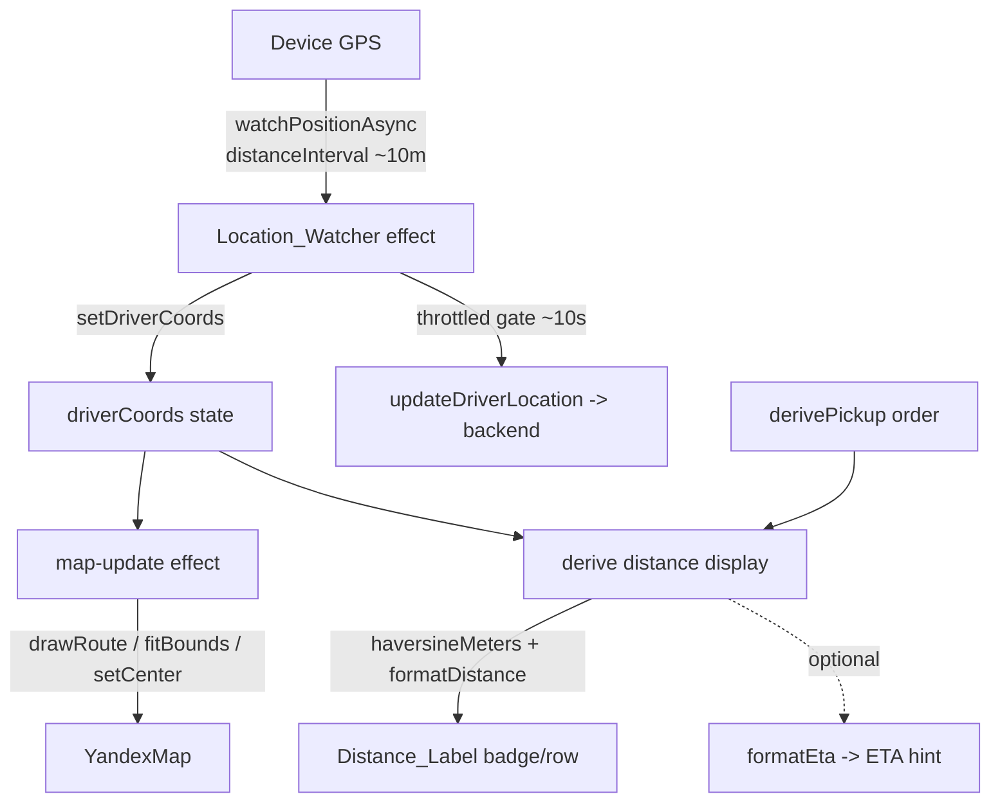

# Design Document: Driver Live Distance

## Overview

This feature adds a **live, near-real-time distance readout** to the driver order detail
screen (`app/order/[id].tsx`) of the Sarix Go driver app. It builds directly on the
`driver-pickup-map` feature, which already renders an in-app Yandex map with a pickup
marker, a driver marker, and a driver→pickup route, and which already maintains the
driver's position in the `driverCoords` state via a ~10-second location loop that also
broadcasts the position to the backend.

The contribution of this feature is twofold:

1. **A pure distance/format module** — two new total functions added to the existing
   `driverMap.helpers.ts`: `haversineMeters(a, b)` (great-circle distance in meters) and
   `formatDistance(meters)` (human-friendly `"3.2 km"` / `"450 m"` formatting), plus an
   optional `formatEta(meters, avgSpeedKmh)` hint.
2. **A real-time location subscription** — replacing the polling `setInterval`
   (`getCurrentPositionAsync`) loop with `Location.watchPositionAsync`, which emits a new
   `driverCoords` on meter-level movement so the distance, driver marker, and route all
   refresh smoothly. The backend broadcast (`updateDriverLocation`) is **decoupled** from
   this stream and gated by a last-sent timestamp so it continues at its existing ~10s
   cadence and does not flood the backend.

The map route and markers already react to `driverCoords` through the existing
map-update effect, so they benefit automatically from the higher update frequency — no
change to the map component or its imperative handle is required.

### Design Goals

- Keep all distance math and formatting **pure and side-effect-free** so it is directly
  unit- and property-testable, consistent with the existing `driverMap.helpers.ts` style
  (every helper is a TOTAL function that never throws on `null`/`NaN`/`Infinity`).
- **Do not regress** the existing map, route, external navigation, backend broadcast,
  contact-window countdown, passenger/route cards, or completion flow.
- Decouple **display cadence** (fast, local) from **backend cadence** (throttled, ~10s).
- Degrade gracefully when pickup is missing, driver location is not yet known, or
  location permission is denied.

### Research Notes

- **`expo-location` watch API**: `Location.watchPositionAsync(options, callback)` returns
  a `Promise<LocationSubscription>`; the subscription exposes `remove()` to stop updates.
  Options of interest: `accuracy`, `timeInterval` (minimum ms between updates), and
  `distanceInterval` (minimum meters of movement between updates). Using a small
  `distanceInterval` (~10 m) plus a modest `timeInterval` gives smooth countdown updates
  while the OS coalesces noise. Source: [Expo Location docs](https://docs.expo.dev/versions/latest/sdk/location/). Content was rephrased for compliance with licensing restrictions.
- **Haversine formula**: standard great-circle distance using Earth mean radius
  R = 6,371,000 m. It is symmetric, always non-negative, and zero for identical points —
  exactly the invariants we want to assert as correctness properties.
- The existing screen already requests foreground permission via
  `Location.requestForegroundPermissionsAsync()` and tolerates failures by swallowing
  them; the new watcher follows the same defensive pattern.

## Architecture



### Layered View

- **Pure logic layer** (`driverMap.helpers.ts`): `haversineMeters`, `formatDistance`,
  optional `formatEta`. No React, no I/O. Reused by both the screen and the tests.
- **Effect layer** (`app/order/[id].tsx`): the `Location_Watcher` effect owns the
  subscription lifecycle and the throttled backend broadcast. It only writes
  `driverCoords` and (conditionally) calls `updateDriverLocation`.
- **Presentation layer** (`app/order/[id].tsx`): derives the `Distance_Label` from
  `driverCoords` + `derivePickup(order)` on each render and renders a badge/row. Stateless
  with respect to distance — the label is computed, not stored, so it always reflects the
  latest coords.

### Key Decision: Watcher Replaces the Poll Loop

The existing effect uses `getCurrentPositionAsync` inside `setInterval(..., 10000)` and,
on each tick, both updates `driverCoords` and calls `updateDriverLocation`. This feature
**replaces that single effect** with one `watchPositionAsync` subscription that:

- fires frequently (meter-level) → updates `driverCoords` every time (drives the live
  distance, marker, and route);
- calls `updateDriverLocation` **only** when at least ~10s have elapsed since the last
  successful send (a `lastSentAtRef` timestamp gate) → preserves the backend cadence.

This keeps a **single source of GPS truth** and avoids running two concurrent location
mechanisms (which Requirement 5.6 forbids).

## Components and Interfaces

### New pure helpers (in `src/components/driverMap.helpers.ts`)

```text
haversineMeters(a: Coords, b: Coords): number
  - Great-circle distance in meters between two coordinate pairs.
  - TOTAL: returns NaN (sentinel "no distance") if either point is non-finite,
    so callers can guard with Number.isFinite before formatting.
  - Does not mutate a or b.

formatDistance(meters: number): string
  - meters >= 1000  -> `${(meters / 1000).toFixed(1)} km`   (e.g. "3.2 km")
  - 0 <= meters < 1000 -> `${Math.round(meters)} m`         (e.g. "450 m")
  - meters is NaN / negative / non-finite -> safe fallback ("—") rather than throwing.

formatEta(meters: number, avgSpeedKmh: number): string   // OPTIONAL
  - Derives a coarse ETA from distance and an assumed average speed.
  - Non-negative; zero distance -> zero duration; invalid input -> safe fallback.
```

These mirror the existing helper conventions (exported pure functions, defensive against
bad input, no React imports).

### Screen integration points (in `app/order/[id].tsx`)

The screen already imports `derivePickup`, `deriveShouldDrawRoute`, `deriveMarkers`,
`Coords`, etc. New usage:

- A small derivation block per render:
  ```text
  pickup = derivePickup(order)
  distanceMeters = (driverCoords && pickup) ? haversineMeters(driverCoords, pickup) : NaN
  ```
- A presentation decision (see Data Models → Display State) that maps the available data
  to one of: `LABEL` | `PICKUP_MISSING` | `LOADING` | `HIDDEN`.
- A new UI element rendering the chosen state (a badge overlaid on the existing
  `mapCard`, or a row in the route card). The existing `mapUnavailable` overlay already
  covers the pickup-missing case for the map; the distance element reuses the same
  signal for consistency.

### Modified effect: `Location_Watcher`

Replaces the existing `LOCATION_INTERVAL_MS` `setInterval` effect. Responsibilities:

- Request foreground permission (unchanged call).
- If granted **and** the order is an Active_Order, start **one**
  `watchPositionAsync({ accuracy, timeInterval, distanceInterval })` subscription.
- On each callback: `setDriverCoords(...)`; then if `now - lastSentAt >= ~10s`, call
  `updateDriverLocation(...)` and update `lastSentAt`.
- Cleanup: `subscription.remove()` on unmount or when the order is no longer active or
  permission is not granted (dependency on `order?.id`, `order?.status`).

### Unchanged interfaces

- `YandexMap` / `YandexMapHandle` (`drawRoute`, `fitBounds`, `setCenter`) — untouched.
- `updateDriverLocation(lat, lon)` API signature — untouched; only its **call cadence
  source** changes (now gated inside the watcher).
- `buildNavCandidates` and `openNavigation` external-navigation flow — untouched.

## Data Models

### Coords (existing, unchanged)

```text
Coords = { lat: number; lon: number }
```

### Distance computation result

`haversineMeters` returns a `number`:
- a finite, non-negative meter value when both inputs are finite;
- `NaN` as the "no distance" sentinel when either input is non-finite (Requirement 1.4).

### Display State (derived, not stored)

A render-time classification used to choose what to show. Conceptually:

```text
DistanceDisplay =
  | { kind: 'LABEL';          text: string }   // pickup + driver known -> formatDistance(...)
  | { kind: 'PICKUP_MISSING'; }                // pickup null -> "location unavailable"
  | { kind: 'LOADING'; }                       // pickup known, driver not yet known
  | { kind: 'HIDDEN'; }                        // not an active order / permission denied
```

Decision precedence:
1. Not an Active_Order → `HIDDEN`.
2. `derivePickup(order) === null` → `PICKUP_MISSING` (nav button still works).
3. `driverCoords === null` → `LOADING`.
4. Otherwise → `LABEL` with `formatDistance(haversineMeters(driverCoords, pickup))`.

Because the label is **derived on each render** from the latest `driverCoords`, it always
reflects the most recent location update (supports the "uses latest coords" property).

### Watcher lifecycle state (effect-local, not React state)

```text
subscriptionRef : LocationSubscription | null   // the single active watch (Req 5.6)
lastSentAtRef   : number (epoch ms)              // backend-throttle gate (Req 4.4)
```

Holding these in refs (not state) avoids re-renders and guarantees the throttle gate and
single-subscription invariant survive re-renders.

### Tuning constants

```text
WATCH_DISTANCE_INTERVAL_M = 10     // meters of movement to trigger an update
WATCH_TIME_INTERVAL_MS    = 2000   // floor between updates (smoothing)
BACKEND_MIN_INTERVAL_MS   = 10000  // preserve existing ~10s broadcast cadence
ETA_AVG_SPEED_KMH         = 30     // optional ETA assumed average speed
```


## Correctness Properties

*A property is a characteristic or behavior that should hold true across all valid
executions of a system — essentially, a formal statement about what the system should do.
Properties serve as the bridge between human-readable specifications and
machine-verifiable correctness guarantees.*

The distance math and formatting are pure functions over a large input space (all
coordinate pairs, all non-negative distances), making them ideal for property-based
testing. The location subscription, permission gating, and lifecycle are side-effecting
and external — they are validated by mock-based integration tests (see Testing Strategy)
rather than properties. The properties below were consolidated during prework reflection
to remove redundancy.

### Property 1: Haversine distance is non-negative and symmetric

*For any* two finite `Coords` `a` and `b`, `haversineMeters(a, b)` returns a finite,
non-negative number, and `haversineMeters(a, b)` equals `haversineMeters(b, a)` (within
floating-point tolerance). For any input where either point contains a `null` or
non-finite component, the function returns the `NaN` "no distance" sentinel and never
throws.

**Validates: Requirements 1.1, 1.2, 1.4**

### Property 2: Identical coordinates have zero distance

*For any* finite `Coords` `a`, `haversineMeters(a, a)` equals `0` (within floating-point
tolerance).

**Validates: Requirements 1.3**

### Property 3: Kilometer formatting at and above 1000 meters

*For any* distance `m` with `m >= 1000`, `formatDistance(m)` equals
`` `${(m / 1000).toFixed(1)} km` `` — a value in kilometers rounded to exactly one decimal
place followed by `" km"`.

**Validates: Requirements 2.1, 2.4**

### Property 4: Meter formatting below 1000 meters

*For any* distance `m` with `0 <= m < 1000`, `formatDistance(m)` equals
`` `${Math.round(m)} m` `` — the distance rounded to the nearest whole meter followed by
`" m"`.

**Validates: Requirements 2.2, 2.3**

### Property 5: Formatting totality

*For any* finite non-negative distance `m`, `formatDistance(m)` returns a non-empty
string. For any `NaN`, negative, or non-finite input, it returns a non-empty safe
fallback string rather than throwing.

**Validates: Requirements 2.5**

### Property 6: Distance computation does not mutate its inputs

*For any* `Coords` `a` and `b`, calling `haversineMeters(a, b)` leaves `a` and `b`
structurally unchanged (their `lat`/`lon` fields are equal before and after the call).

**Validates: Requirements 1.5**

### Property 7: Display, marker, and route use the latest single coordinate source

*For any* sequence of driver location updates ending in `latestCoords`, when a pickup is
available the displayed `Distance_Label` equals
`formatDistance(haversineMeters(latestCoords, pickup))`, and the coordinates feeding the
driver marker and the driver→pickup route equal `latestCoords` — i.e. label, marker, and
route are always derived from the same most-recent `driverCoords`.

**Validates: Requirements 3.4, 4.2, 4.5**

### Property 8: Backend broadcast throttle invariant

*For any* stream of timestamped location-update events, the display updates on every
event while the backend broadcast (`updateDriverLocation`) is invoked only when at least
`BACKEND_MIN_INTERVAL_MS` (~10s) has elapsed since the previous successful broadcast;
consequently the number of broadcasts never exceeds the number of events and consecutive
broadcasts are spaced at least ~10s apart.

**Validates: Requirements 4.3, 4.4**

### Property 9: Last known label is retained on update failure

*For any* sequence of location updates in which some updates fail, the displayed
`Distance_Label` equals `formatDistance(haversineMeters(lastSuccessfulCoords, pickup))`
and no failure causes the computation to throw or the label to be cleared.

**Validates: Requirements 5.5**

### Property 10 (optional): ETA hint is non-negative and zero at zero distance

*For any* non-negative distance `m` and positive assumed average speed, `formatEta`
derives a non-negative duration, and when `m` is `0` the derived duration is zero.

**Validates: Requirements 6.1, 6.2, 6.3**

## Error Handling

| Condition | Handling | Requirement |
|-----------|----------|-------------|
| Either coordinate non-finite / `null` | `haversineMeters` returns `NaN` sentinel; display falls to `LOADING`/`PICKUP_MISSING`; never throws | 1.4 |
| `formatDistance` given `NaN`/negative/non-finite | Returns non-empty safe fallback (`"—"`) | 2.5 |
| Pickup_Location null | Display shows `PICKUP_MISSING` placeholder; external navigation button remains operational | 3.2, 5.1 |
| Driver_Location not yet known | Display shows `LOADING` placeholder | 3.3 |
| Location permission denied | Watcher does not start; no live updates; navigation button still works | 5.2 |
| A single `watchPositionAsync` callback or `getCurrent` failure | Swallowed (try/catch, matching existing pattern); `driverCoords` unchanged so last label retained | 5.5 |
| Backend `updateDriverLocation` rejects | Swallowed; does not advance `lastSentAt` so a later event can retry; display unaffected | 5.5, 7.3 |
| Screen unmount / order becomes inactive | Effect cleanup calls `subscription.remove()`; ref cleared | 5.3, 5.4 |
| Re-render / dependency churn | New subscription started only after prior `remove()`; `subscriptionRef` enforces ≤ 1 active | 5.6 |

## Testing Strategy

### Dual approach

- **Property-based tests** validate the pure, universally-quantified logic
  (`haversineMeters`, `formatDistance`, the latest-coords consistency, the throttle gate,
  and retain-on-failure behavior).
- **Unit / example tests** cover the display-state precedence branches (LABEL,
  PICKUP_MISSING, LOADING, HIDDEN) and specific formatting boundaries (e.g. exactly
  999.5 m, exactly 1000 m).
- **Mock-based integration tests** cover the side-effecting watcher: subscription start
  conditions, permission denial, unmount/inactive cleanup, single-subscription
  invariant, and non-regression of map/nav/broadcast/countdown.

### Property-based testing library

Use **`fast-check`** with the existing Jest test runner (the project is a TypeScript /
Expo React Native app, and `fast-check` is the standard PBT library for that stack). Do
NOT hand-roll property generation.

- Each property test runs a **minimum of 100 iterations**.
- Each property test is tagged with a comment referencing its design property, in the
  format: **Feature: driver-live-distance, Property {number}: {property_text}**.
- Each correctness property is implemented by a **single** property-based test.
- Generators: random finite `Coords` (lat ∈ [-90, 90], lon ∈ [-180, 180]); distance
  floats spanning both `[0, 1000)` and `[1000, ∞)` ranges including the 1000 m boundary;
  edge generators injecting `NaN`/`Infinity`/`null` for the totality and sentinel checks;
  arrays of timestamped events for the throttle and consistency properties.

### Mapping of properties to tests

| Property | Test target | Library |
|----------|-------------|---------|
| P1, P2, P6 | `haversineMeters` (non-negativity, symmetry, sentinel, identity, immutability) | fast-check |
| P3, P4, P5 | `formatDistance` (km/m formatting, totality) | fast-check |
| P7 | display-label / marker / route derivation from latest coords | fast-check |
| P8 | backend throttle gate over event streams | fast-check |
| P9 | retain-last-label under injected failures | fast-check |
| P10 (optional) | `formatEta` | fast-check |

### Integration / non-regression tests (mocked `expo-location`)

- Watcher starts exactly one subscription when order active **and** permission granted,
  with a meter-level `distanceInterval` (4.1, 5.6).
- Permission denied → no subscription; navigation candidates still build (5.2).
- Unmount and status→inactive both call `subscription.remove()` (5.3, 5.4).
- `updateDriverLocation` is still invoked (gated) with finite coords (7.3).
- Smoke render confirms map, markers, route, passenger card, route card, countdown,
  navigation button, and complete button still render alongside the distance readout
  (3.5, 7.1, 7.2, 7.4).

### Notes

- Tasks for these tests will be marked optional (`*`) in the implementation plan; core
  implementation tasks are mandatory.
- Property tests focus on universal correctness; example and integration tests cover
  concrete branches and the non-property side effects per the prework classification.
