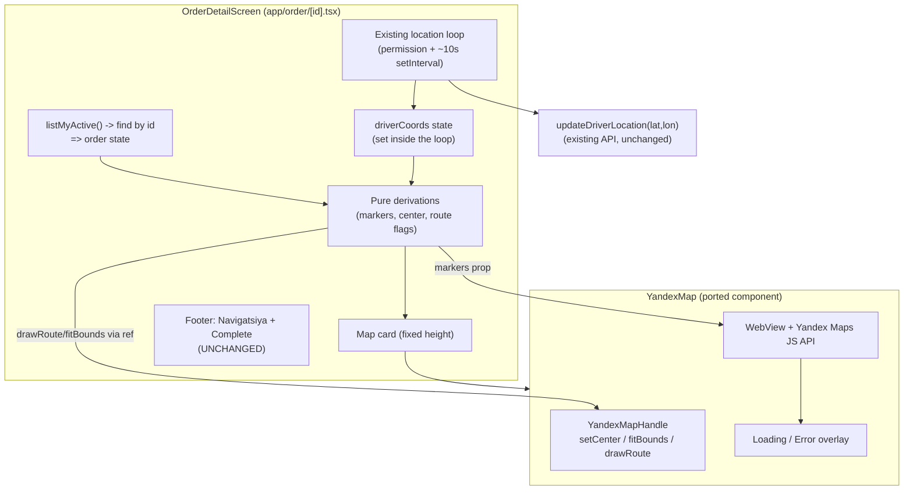

# Design Document: Driver Pickup Map

## Overview

This design adds an in-app Yandex map to the **driver** application (`sarix-go-driver`) on the
accepted-order detail screen (`app/order/[id].tsx`). Today that screen shows the passenger card,
the `from_city → to_city` route as text, departure time, person count, price, an optional note, a
"🧭 Navigatsiya" button (external navigation), and a "Complete" button. There is no visual map.

The feature introduces three capabilities while leaving everything else untouched:

1. **In-app pickup visualization** — a `Pickup_Marker` at the passenger's `from_lat`/`from_lon`.
2. **In-app route preview** — a `Route_Line` from the driver's live GPS position to the pickup,
   with the camera auto-fitting both points.
3. **Preserved external navigation** — the existing `openNavigation()` flow is left exactly as-is.

### Strategy: port, don't reinvent

The passenger app already ships a battle-tested WebView Yandex map at
`sarix-go-app/src/components/YandexMap.tsx`. It exposes an imperative handle
(`setCenter`, `fitBounds`, `drawRoute`), accepts `markers`, fires `onMapReady`, resolves the API
key from `EXPO_PUBLIC_YANDEX_JS_API_KEY` → `expoConfig.extra.yandexJsApiKey`, and includes a
built-in loading/error overlay. We **port this component verbatim (with the same handle API)** into
the driver app at `sarix-go-driver/src/components/YandexMap.tsx`, then integrate it into the order
screen. This minimizes risk: the map internals are already proven in production.

### Key constraint: reuse the existing location loop

The order screen already runs a single location loop while the order is `accepted`/`in_progress`:
it requests foreground permission, calls `Location.getCurrentPositionAsync` once, then on a ~10s
`setInterval` repeatedly fetches the position and calls `updateDriverLocation(lat, lon)`. **We must
not add a second polling loop.** Instead, we capture each fetched position into a new
`driverCoords` state variable *inside the existing loop*, and let the map react to that state via a
`useEffect`. This satisfies Requirement 4.5 (single ~10s loop) and Requirement 6 (map keeps up with
movement) without duplicating timers.

### Design decisions and rationale

| # | Decision | Rationale |
|---|----------|-----------|
| 1 | Port `YandexMap` into the driver app, keeping the same `YandexMapHandle` API | Proven component; identical behavior reduces risk and review cost |
| 2 | Drive the map from a new `driverCoords` state set inside the **existing** loop | Honors Req 4.5 (no second loop); single source of truth for driver position |
| 3 | Derive markers / route conditions with **pure helper functions** | Makes the logic unit/property testable independent of the WebView |
| 4 | Place the map as a fixed-height card near the top of the `ScrollView` (below the banner, above the passenger card) | High visibility; does not disturb the footer with Navigatsiya/Complete |
| 5 | Gate the map render on `order != null && status ∈ {accepted, in_progress}` | Avoids mounting the WebView before data exists (Req 1.1/1.2) |
| 6 | Add `yandexJsApiKey` to the driver `app.json` `extra` (or `EXPO_PUBLIC_YANDEX_JS_API_KEY`) | The ported component needs the key; driver `extra` currently lacks it |
| 7 | Leave `openNavigation()` and the footer untouched | Honors Req 7 (external navigation preserved) |

## Architecture



### Data flow

1. On mount, `listMyActive()` resolves the order by `id` into `order` state (existing behavior).
2. When `order` is active, the existing location loop requests permission and starts the ~10s
   interval. Each successful `getCurrentPositionAsync` now ALSO writes `{lat, lon}` into
   `driverCoords` (new), in addition to calling `updateDriverLocation` (existing).
3. Pure derivation functions compute, from `order` + `driverCoords`:
   - the marker array (pickup and/or driver),
   - whether the pickup-unavailable message should show,
   - the initial center,
   - whether to draw a route and what `from`/`to` to pass.
4. The map card renders `<YandexMap>` with the derived `markers`. On `onMapReady` and on every
   `driverCoords` change, an effect calls `mapRef.current.drawRoute(...)` and `fitBounds(...)` when
   both points exist, or `setCenter(pickup)` when only pickup exists.
5. The footer (Navigatsiya/Complete) and all existing cards remain exactly as today.

## Components and Interfaces

### 1. Ported component: `sarix-go-driver/src/components/YandexMap.tsx`

A near-verbatim copy of the passenger component. Public surface is unchanged:

```ts
export interface MapMarker {
  id: string;
  lat: number;
  lon: number;
  label?: string;
  color?: string;
}

export interface YandexMapProps {
  initialLat?: number;
  initialLon?: number;
  initialZoom?: number;
  markers?: MapMarker[];
  onMapReady?: () => void;
  onMarkerPress?: (id: string) => void;
  onMapPress?: (lat: number, lon: number) => void;
  onCameraMove?: (lat: number, lon: number, zoom: number) => void;
  style?: StyleProp<ViewStyle>;
}

export interface YandexMapHandle {
  setCenter: (lat: number, lon: number, zoom?: number) => void;
  fitBounds: (markers: MapMarker[]) => void;
  drawRoute: (from: [number, number], to: [number, number]) => void;
}
```

**API key resolution (ported as-is):**

```ts
const YANDEX_API_KEY =
  process.env.EXPO_PUBLIC_YANDEX_JS_API_KEY ||
  (Constants.expoConfig?.extra as any)?.yandexJsApiKey ||
  process.env.EXPO_PUBLIC_YANDEX_MAPS_KEY ||
  (Constants.expoConfig?.extra as any)?.yandexMapsApiKey ||
  '';
```

Because the driver `app.json` `extra` block currently contains only `apiBaseUrl`, the key resolves
to `''` until provisioned. With an empty key the component still renders and surfaces the error
overlay (the HTML's `__mapApiError` / `waitForYmaps` timeout path) — it does NOT crash. Provisioning
the key (add `"yandexJsApiKey": "<key>"` to the driver `extra`, or set
`EXPO_PUBLIC_YANDEX_JS_API_KEY`) is a configuration action outside the code scope (Req 8.4).

The component's loading/error overlay, WebView config (`baseUrl: 'https://yandex.com/'`,
`originWhitelist`, `mixedContentMode`, etc.), and the embedded HTML (`init`, `setMarkers`,
`setCenter`, `fitBounds`, `drawRoute`, `waitForYmaps`) are ported unchanged.

### 2. Pure helpers (new) — colocated in the screen or `src/components/driverMap.helpers.ts`

These isolate all map decision logic from the WebView so they are directly testable.

```ts
type Coords = { lat: number; lon: number };

// A finite, real coordinate pair.
function isFiniteCoord(lat: unknown, lon: unknown): boolean;

// Pickup coords from the order, or null when from_lat/from_lon are not both finite.
function derivePickup(order: DriverOrder | null): Coords | null;

// True only when the order is loaded AND status is active.
function deriveMapVisible(order: DriverOrder | null): boolean;

// True when the pickup-unavailable message must show (i.e., no valid pickup).
function derivePickupUnavailable(order: DriverOrder | null): boolean;

// Marker list: pickup marker (color = accent) and/or driver marker (color = info),
// always with distinct ids ('pickup' vs 'driver') and distinct colors.
function deriveMarkers(pickup: Coords | null, driver: Coords | null): MapMarker[];

// Initial center: pickup when present, else driver, else Termiz default.
function deriveInitialCenter(pickup: Coords | null, driver: Coords | null): Coords;

// True only when BOTH driver and pickup are available.
function deriveShouldDrawRoute(driver: Coords | null, pickup: Coords | null): boolean;

// The exact candidate URL list used by external navigation (ported from openNavigation).
function buildNavCandidates(lat: number, lon: number, os: 'ios' | 'android'): string[];
```

Marker colors use the theme: `Pickup_Marker` = `colors.accent` (`#F4C430`), `Driver_Marker` =
`colors.info` (`#3B82F6`) — guaranteeing visual distinctness (Req 2.3).

### 3. Screen integration: `app/order/[id].tsx` (modified)

New state and ref:

```ts
const mapRef = useRef<YandexMapHandle>(null);
const [driverCoords, setDriverCoords] = useState<{ lat: number; lon: number } | null>(null);
const [mapReady, setMapReady] = useState(false);
```

**Reuse the existing loop** — augment `sendOnce` to also populate `driverCoords` (no new timer):

```ts
const sendOnce = async () => {
  try {
    const pos = await Location.getCurrentPositionAsync({ accuracy: Location.Accuracy.Balanced });
    if (!cancelled) {
      setDriverCoords({ lat: pos.coords.latitude, lon: pos.coords.longitude }); // NEW
      await updateDriverLocation(pos.coords.latitude, pos.coords.longitude);     // EXISTING
    }
  } catch {}
};
```

The existing `cancelled` flag (set in the effect cleanup) already guards against post-unmount state
writes (Req 6.3); we extend the same guard to the map-update effect.

**Map-update effect** (reacts to driver movement; the only thing driving redraws):

```ts
useEffect(() => {
  if (!mapReady) return;
  const pickup = derivePickup(order);
  const driver = driverCoords;
  if (deriveShouldDrawRoute(driver, pickup)) {
    mapRef.current?.drawRoute([driver!.lat, driver!.lon], [pickup!.lat, pickup!.lon]);
    mapRef.current?.fitBounds(deriveMarkers(pickup, driver));
  } else if (pickup) {
    mapRef.current?.setCenter(pickup.lat, pickup.lon);
  }
}, [mapReady, driverCoords, order?.from_lat, order?.from_lon]);
```

### Component / interface summary

| Component | Type | Responsibility |
|-----------|------|----------------|
| `YandexMap` (ported) | RN component + WebView | Render map, expose handle, show loading/error overlay |
| `deriveMarkers` / `derivePickup` / `deriveInitialCenter` | pure fns | Compute map inputs from order + driver coords |
| `deriveMapVisible` / `derivePickupUnavailable` | pure predicates | Gate rendering and fallback messaging |
| `deriveShouldDrawRoute` | pure predicate | Decide when route/fit applies |
| `buildNavCandidates` | pure fn | Encapsulate the existing external-nav URL order (no behavior change) |
| `OrderDetailScreen` | RN screen | Wire state, existing loop, map effect, layout |

## Data Models

No backend or persisted-schema changes. The existing `DriverOrder` (in `src/api/driver.ts`) already
carries everything needed:

```ts
interface DriverOrder {
  id: number;
  from_city: string;
  to_city: string;
  from_address?: string | null;
  from_lat?: number | null;   // pickup latitude  (nullable)
  from_lon?: number | null;   // pickup longitude (nullable)
  status: string;             // 'accepted' | 'in_progress' | ...
  // ...passenger_name, passenger_phone, price, person_count, note, accepted_at, etc.
}
```

New in-memory, screen-local models:

```ts
type Coords = { lat: number; lon: number };           // a valid GPS pair
type MapMarker = { id: string; lat: number; lon: number; label?: string; color?: string };
// driverCoords: Coords | null   — latest GPS from the existing loop
// markers: MapMarker[]          — derived: [] | [pickup] | [pickup, driver] | [driver]
```

Marker identity is fixed by role: `id: 'pickup'` and `id: 'driver'`. There is no `to_lat`/`to_lon`
in the order, so the route is always **driver → pickup** (matching the existing `openNavigation`
destination), not a full trip route.

## Correctness Properties

*A property is a characteristic or behavior that should hold true across all valid executions of a
system — essentially, a formal statement about what the system should do. Properties serve as the
bridge between human-readable specifications and machine-verifiable correctness guarantees.*

The map's decision logic is extracted into pure functions, so these properties are testable
independently of the WebView. The WebView load/error behavior, the expo-location side effects, and
static UI presence are covered by example/integration tests in the Testing Strategy instead.

### Property 1: Map visibility predicate

*For any* `DriverOrder` value (including `null`), `deriveMapVisible(order)` returns `true` if and
only if `order` is non-null AND `order.status ∈ {accepted, in_progress}`.

**Validates: Requirements 1.1, 1.2**

### Property 2: Marker-set derivation and distinctness

*For any* pair `(pickup, driver)` where each is either a finite `Coords` or `null`, `deriveMarkers`
returns a list that contains a pickup marker at exactly `pickup` iff `pickup` is non-null, contains
a driver marker at exactly `driver` iff `driver` is non-null, and whenever both are present they
have distinct ids (`'pickup'` ≠ `'driver'`) and distinct colors.

**Validates: Requirements 2.1, 2.3, 3.1, 4.3**

### Property 3: Pickup availability is mutually exclusive

*For any* `DriverOrder`, exactly one of the following holds: a pickup marker is produced
(`derivePickup(order) != null`) OR the pickup-unavailable message is flagged
(`derivePickupUnavailable(order) === true`) — never both, never neither.

**Validates: Requirements 2.1, 3.1, 3.2**

### Property 4: Initial-center selection

*For any* `(pickup, driver)`, `deriveInitialCenter` returns `pickup` when `pickup` is non-null;
otherwise it returns `driver` when `driver` is non-null; otherwise the fixed Termiz default. In
particular, when only the pickup is available the center equals the pickup coordinates.

**Validates: Requirements 2.2, 5.4**

### Property 5: Route is drawn exactly when both points exist, using the latest driver position

*For any* finite `pickup` and *for any* finite sequence of driver-position updates
`d₁, d₂, …, dₙ`, `deriveShouldDrawRoute(dᵢ, pickup)` is `true` for every `dᵢ`, and the most recent
`drawRoute` invocation uses `from = dₙ` (the latest driver position) and `to = pickup`. When
`driver` is `null` (permission denied or not yet available), `deriveShouldDrawRoute` is `false` and
no route is drawn.

**Validates: Requirements 5.1, 5.5, 6.1, 6.2; (denied path) 5.4**

### Property 6: Fit-bounds encloses both points

*For any* finite `pickup` and finite `driver`, the marker set passed to `fitBounds` contains exactly
the pickup and driver markers, and the resulting bounds enclose both coordinates (min/max latitude
and longitude span both points).

**Validates: Requirements 5.2**

### Property 7: API-key resolution precedence

*For any* combination of `EXPO_PUBLIC_YANDEX_JS_API_KEY` and `expoConfig.extra.yandexJsApiKey`
values (each possibly empty/undefined), the resolved key equals the env value when it is non-empty,
otherwise the `extra` value when non-empty, otherwise the empty string — never throwing.

**Validates: Requirements 1.3, 8.4**

### Property 8: Derivations are total (never throw)

*For any* arbitrary `DriverOrder` (including null/NaN/Infinity/missing coordinate fields) and *for
any* arbitrary driver-coordinate input, every derivation helper (`derivePickup`, `deriveMarkers`,
`deriveInitialCenter`, `deriveShouldDrawRoute`, `derivePickupUnavailable`, `deriveMapVisible`)
returns a value without throwing.

**Validates: Requirements 3.3, 8.4**

### Property 9: External-navigation candidate construction is unchanged

*For any* finite `(lat, lon)` and either platform, `buildNavCandidates` returns the five candidate
URLs in the existing order (Yandex Navigator → Yandex Maps → platform geo/Apple Maps → Yandex web →
Google Maps web), and every candidate string contains the given `lat` and `lon`.

**Validates: Requirements 7.2, 7.3**

## Error Handling

| Condition | Handling | Requirement |
|-----------|----------|-------------|
| Order not yet loaded (`order === null`) | Existing loading view renders; map NOT mounted. Fallback "loading" text is the existing `t('common.loading')` cue | 1.2, 1.5 |
| `from_lat`/`from_lon` null or missing | `derivePickup` → `null`: no pickup marker; inline "pickup location unavailable" message shown in the map card; rest of screen fully functional | 3.1, 3.2, 3.3 |
| Missing coords + Navigatsiya tapped | Existing `openNavigation` alert ("Yo'lovchining joylashuvi mavjud emas") — unchanged | 3.4 |
| Location permission denied | `driverCoords` stays `null`: no driver marker, no route; map centers on pickup | 5.4 |
| Driver location not yet available | Markers shown for what exists; pending indicator for driver; no route until coords arrive | 4.4, 5.5 |
| Route build fails | Ported component swallows the `ymaps.route` rejection (logs, no throw); pickup/driver markers remain | 5.3 |
| Component unmounts mid-update | Existing `cancelled` guard short-circuits state writes; map-effect bails when `!mapReady`/unmounted | 6.3 |
| Map load failure (network / bad or missing key / API timeout) | Ported overlay shows error state; screen + Navigatsiya remain functional | 8.1, 8.3 |
| Map loading in progress | Ported overlay shows `ActivityIndicator` | 8.2 |
| API key absent from driver config | `resolveApiKey` → `''`; component renders and surfaces overlay rather than crashing | 8.4 |

All derivation helpers are written as total functions (Property 8) so malformed order data degrades
gracefully instead of throwing inside render.

## Testing Strategy

PBT **is** applicable here: the map's decision logic is a set of pure functions over order and
coordinate inputs with clear universal properties (marker derivation, route conditions, key
resolution, nav-URL construction). The WebView rendering, expo-location side effects, and static UI
presence are NOT property-amenable and are covered by example/integration tests.

### Property-based tests (≥100 iterations each)

Use a property-based testing library for the TypeScript/React Native stack (e.g.,
`fast-check`) — do not hand-roll generators. Each test is tagged
`Feature: driver-pickup-map, Property {n}: {property_text}` and references its design property.
Generators must include edge cases: `null`/missing coords, `NaN`/`Infinity`, equal driver==pickup
points, antipodal/extreme lat-lon, and empty/undefined key strings.

| Property | What the test generates / asserts |
|----------|-----------------------------------|
| Property 1 | Random orders (status + null) → visibility predicate exact |
| Property 2 | Random `(pickup, driver)` presence/coords → correct markers, distinct id+color |
| Property 3 | Random orders → pickup-marker XOR unavailable-message |
| Property 4 | Random `(pickup, driver)` → center precedence (pickup → driver → default) |
| Property 5 | Random pickup + coord sequence → always draw, last `drawRoute` uses latest driver; driver=null → no route |
| Property 6 | Random finite pickup+driver → fit set = {pickup, driver}, bounds enclose both |
| Property 7 | Random (env, extra) key pairs → precedence, no throw |
| Property 8 | Fuzzed/garbage order + coords → no derivation throws |
| Property 9 | Random `(lat, lon, os)` → 5 candidates in order, each contains coords |

### Unit / example tests

- Order-loaded render shows the map card alongside passenger card, route rows, Navigatsiya, and
  Complete buttons (Req 1.4, 7.1).
- `order === null` renders loading view and does not mount the WebView (Req 1.2, 1.5).
- `openNavigation` with null coords shows the alert and opens no URL (Req 3.4).
- Driver-pending indicator shows when permission granted but no coords yet (Req 4.4).
- Map error overlay shown while Navigatsiya still triggers `openNavigation` (Req 8.3).
- Empty API key → screen renders without crash (Req 8.4).

### Integration tests (mocked; 1–3 examples)

- `expo-location` mocked: mounting an active order calls `requestForegroundPermissionsAsync`, and a
  single ~10s interval feeds both `updateDriverLocation` and `driverCoords` — asserting exactly one
  interval exists, no second loop (Req 4.1, 4.2, 4.5).
- `react-native-webview` mocked: `apiError`/`onError`/`onHttpError` messages flip the overlay to the
  error state (Req 8.1); default state shows the loading indicator until `ready` (Req 8.2).
- Forced `ymaps.route` rejection leaves markers intact, no thrown error (Req 5.3).
- Post-unmount async position resolution performs no state update / no handle call (Req 6.3).
- `Linking` mocked: first openable candidate opens; falls through to the Google web link
  (Req 7.2, 7.3).

### Requirements coverage map

| Requirement | Covered by |
|-------------|-----------|
| 1 (render map) | Property 1; example render tests |
| 2 (pickup pin) | Properties 2, 3, 4 |
| 3 (missing coords) | Properties 2, 3, 8; openNavigation example |
| 4 (driver location) | Properties 2, 5; location integration tests |
| 5 (draw + fit route) | Properties 5, 6; route-failure integration test |
| 6 (live updates) | Property 5; unmount integration test |
| 7 (preserve external nav) | Property 9; Linking integration test; presence example |
| 8 (map error overlay) | Property 7; overlay/integration + empty-key examples |
