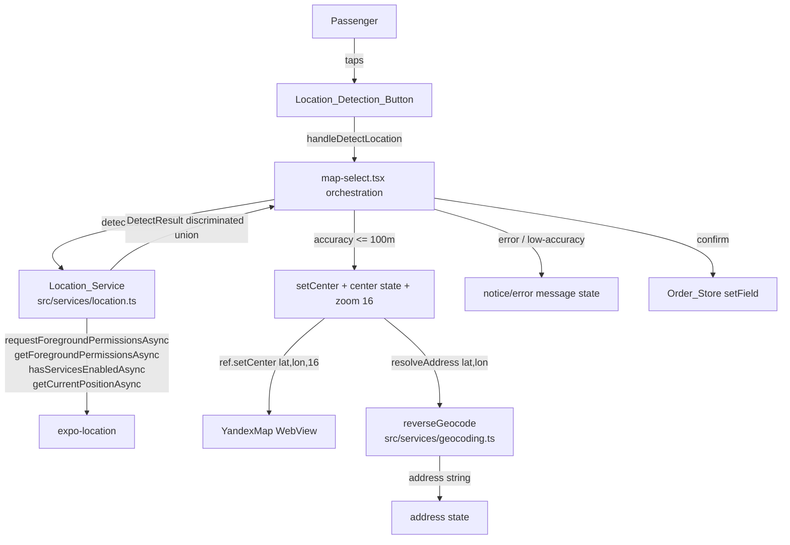

# Design Document: Location Auto-Detect

## Overview

This feature adds a one-tap "detect my current location" capability to the map-based
address picker (`sarix-go-app/app/map-select.tsx`). Today a passenger sets a point by
panning/tapping the map; the map center acts as the pin and is reverse-geocoded to an
address. This feature adds a **Location_Detection_Button** overlaid on the map that, when
tapped, requests location permission, acquires the device's GPS position, recenters the map
on that position at street-level zoom, and reuses the existing reverse-geocode flow to
auto-fill the address.

The design introduces one new module — a **Location_Service** (`src/services/location.ts`)
that wraps `expo-location` behind a small, typed, UI-agnostic API returning a discriminated
result — and modifies `map-select.tsx` to render the button and orchestrate the
permission → acquisition → accuracy-check → recenter → reverse-geocode flow. No backend
changes are required.

### Key Constraints Discovered in the Code

These facts were confirmed by reading the existing source and shape the design:

- **The map center is the pin.** `map-select.tsx` keeps a `center` state `{ lat, lon }`;
  `handleConfirm` writes `center.lat`/`center.lon` plus the resolved `address` into the
  Order_Store. Recentering the map therefore means updating `center` **and** moving the
  WebView map so the two stay in sync.
- **`YandexMap` already exposes an imperative `setCenter(lat, lon, zoom?)`** via
  `useImperativeHandle` / the `YandexMapHandle` interface, but `map-select.tsx` does **not**
  currently attach a `ref`. The map is driven only by `initialLat/initialLon/initialZoom`
  (used once on mount) plus `onCameraMove`/`onMapPress` callbacks. To programmatically
  recenter we will attach a `ref` and call `setCenter`.
- **`onCameraMove` already reports `(lat, lon, zoom)`** (the screen currently ignores the
  third argument). The WebView emits `boundschange` on every camera move, including
  programmatic `setCenter` calls — this matters for debounce/feedback ordering.
- **`reverseGeocode(lat, lon)` returns `Promise<string | null>`** and never throws (it
  catches internally and returns `null`). The screen's `resolveAddress` already debounces
  500 ms and guards against stale responses via `reqIdRef`.
- **`expo-location ~18.0.0`** is declared in `package.json`. **`app.json`** declares the
  iOS `NSLocationWhenInUseUsageDescription` string, the Android `ACCESS_FINE_LOCATION` /
  `ACCESS_COARSE_LOCATION` permissions, and registers the `expo-location` config plugin.
  No native config changes are needed.
- **`Default_Center`** is `lat 37.224, lon 67.278` (Termiz), defined as `DEFAULT_LAT`/
  `DEFAULT_LON` in `map-select.tsx`.

## Architecture



### Flow Summary

1. The passenger taps the Location_Detection_Button.
2. `handleDetectLocation` ignores the tap if a detection is already in progress
   (`detecting` flag), otherwise sets `detecting = true` and clears any prior notice.
3. The orchestrator calls `Location_Service.detectLocation({ timeoutMs: 15000 })`, which:
   checks/requests permission, checks whether services are enabled, then acquires a single
   current position with `Balanced` accuracy and a 15 s timeout, returning a discriminated
   `DetectResult`.
4. On `success`, the orchestrator classifies horizontal accuracy against the 100 m
   threshold:
   - **Within threshold:** update `center` state, call the map ref's `setCenter(lat, lon, 16)`,
     and invoke the existing `resolveAddress(lat, lon)` (500 ms debounce) to auto-fill the
     address.
   - **Beyond threshold:** keep the existing center, show a low-accuracy notice prompting
     manual pin adjustment.
5. On any error variant (`permission-denied`, `services-disabled`, `timeout`, `error`), the
   orchestrator shows the corresponding message and leaves the map center unchanged.
6. `detecting` is cleared in a `finally` so the button always returns to its idle state.
7. Manual panning/tapping and the existing confirm flow remain fully available throughout.

### Design Decision: Recentering Strategy (imperative ref vs. re-render)

**Decision: use the imperative `ref.setCenter(lat, lon, 16)` handle.**

`initialLat/initialLon/initialZoom` are consumed only when the WebView HTML is generated on
mount; changing those props does **not** move an already-loaded map (and would force a costly
WebView reload). `YandexMap` already implements `setCenter` over the WebView bridge with a
smooth 500 ms animation and accepts an optional zoom argument, which directly satisfies the
"zoom level 16" requirement. We therefore attach a `useRef<YandexMapHandle>` to the map and
call `mapRef.current?.setCenter(lat, lon, 16)`. The local `center` state is updated in the
same step so the confirmation coordinate matches what the map shows. (The subsequent
`boundschange` → `onCameraMove` echo is harmless: it re-reports the same coordinate the
screen just set.)

### Design Decision: Notice/Error Presentation (Alert vs. inline)

**Decision: inline, non-blocking notice rendered inside the existing bottom card.**

The screen already renders status text in the bottom card (the "Manzil aniqlanmoqda..." /
"Manzil topilmadi" area). A dismissible inline notice line is consistent with that pattern,
never blocks the map, and keeps manual selection immediately available — which Requirement 7
mandates. A modal `Alert` would obscure the map and interrupt the flow, so it is rejected for
the primary notice channel. The notice is cleared automatically when a new detection starts
or when the camera moves due to manual interaction.

## Components and Interfaces

### 1. Location_Service (new module: `src/services/location.ts`)

A pure wrapper around `expo-location` that performs permission handling, service-enabled
checks, and a single bounded position acquisition, returning a discriminated union. It
contains **no UI** and **no React** dependencies, which keeps it unit-testable and reusable.

```typescript
// Successful acquisition
interface DetectSuccess {
  status: 'success';
  lat: number;
  lon: number;
  accuracy: number | null; // horizontal accuracy in meters (null if unknown)
}

// Discriminated error variants
type DetectError =
  | { status: 'permission-denied' }   // OS permission not granted
  | { status: 'services-disabled' }   // device location services turned off
  | { status: 'timeout' }             // no fix within Detection_Timeout
  | { status: 'error'; message?: string }; // any other acquisition failure

type DetectResult = DetectSuccess | DetectError;

interface DetectOptions {
  timeoutMs?: number; // defaults to 15000 (Detection_Timeout)
}

async function detectLocation(opts?: DetectOptions): Promise<DetectResult>;
```

**Internal behavior (mapping to `expo-location`):**

| Step | expo-location call | Outcome |
|------|--------------------|---------|
| 1. Read current permission | `getForegroundPermissionsAsync()` | If already `denied` and not requestable, short-circuit to `{ status: 'permission-denied' }` without re-prompting (R2.5). |
| 2. Request if undetermined | `requestForegroundPermissionsAsync()` | If result not `granted` → `{ status: 'permission-denied' }` (R2.3). |
| 3. Check services | `hasServicesEnabledAsync()` | If `false` → `{ status: 'services-disabled' }` (R3.5). |
| 4. Acquire position | `getCurrentPositionAsync({ accuracy: Balanced })` raced against a 15 s timer | First fix → `{ status: 'success', lat, lon, accuracy }` (R3.2). Timer wins → `{ status: 'timeout' }` (R3.4). Thrown error → `{ status: 'error' }` (R7.2). |

- Accuracy is `Location.Accuracy.Balanced` so the OS returns the **first usable fix**
  promptly rather than waiting for maximum precision (R3.2).
- The timeout is implemented as a `Promise.race` between `getCurrentPositionAsync` and a
  15 s timer so the service resolves deterministically even if the OS call hangs (R3.4,
  R7.5). A `try/catch` converts any thrown error into `{ status: 'error' }` (R7.2).
- The service never throws; all paths resolve to a `DetectResult`, simplifying the caller.

### 2. Location_Detection_Button (new UI in `map-select.tsx`)

An overlay control positioned on the map area (e.g., bottom-right above the bottom card).

- **Layout:** a `TouchableOpacity` with `minWidth`/`minHeight` of 44 dp and adequate
  `hitSlop` to guarantee the 44x44 dp tappable area (R1.1).
- **Idle content:** a location icon (emoji glyph `📍`/`🎯` rendered via `<Text>`, consistent
  with the existing `pin`/`addressIcon` glyph approach in this file) plus a non-empty label
  (e.g., "Mening joylashuvim") (R1.2). Because the icon is a text glyph it cannot fail to
  load as a remote asset; if a future icon asset is used and is unavailable, the label
  renders alone and the control stays tappable (R1.3).
- **Loading content:** while `detecting` is true, the icon is replaced by an
  `<ActivityIndicator>` (the same component already imported in the file) and the label may
  show a progress word; the button remains mounted/enabled but its `onPress` is guarded
  (R1.4, R6.1–R6.3).
- **Visibility:** rendered unconditionally for both `from` and `to` modes (R1.5).

### 3. Detection Orchestrator: `handleDetectLocation` (new handler in `map-select.tsx`)

```typescript
const handleDetectLocation = useCallback(async () => {
  if (detecting) return;            // ignore concurrent taps (R1.4)
  setNotice(null);
  setDetecting(true);
  try {
    const result = await detectLocation({ timeoutMs: 15000 });
    switch (result.status) {
      case 'success': {
        const acc = result.accuracy;
        if (acc != null && acc > ACCURACY_THRESHOLD_M) {      // 100 m
          setNotice({ kind: 'low-accuracy', text: /* prompt manual adjust */ });
          return;                                              // keep center (R4.4, R7.1)
        }
        setCenter({ lat: result.lat, lon: result.lon });       // R4.1, R4.2
        mapRef.current?.setCenter(result.lat, result.lon, 16); // R4.3 (zoom 16)
        resolveAddress(result.lat, result.lon);                // R5.1 (reuses 500 ms debounce)
        break;
      }
      case 'permission-denied':  setNotice({ kind: 'permission', ... }); break; // R2.3/2.5
      case 'services-disabled':  setNotice({ kind: 'services', ... });   break; // R3.5
      case 'timeout':            setNotice({ kind: 'timeout', ... });    break; // R3.4/R7.5
      case 'error':              setNotice({ kind: 'error', ... });      break; // R7.2
    }
  } finally {
    setDetecting(false);          // always restore idle state (R6.3, R6.4)
  }
}, [detecting, resolveAddress]);
```

The handler **reuses** the existing `center` state, `resolveAddress` (with its 500 ms
debounce, stale-guard, and `resolving` indicator), and `handleConfirm`/Order_Store write
path unchanged. The only new state is `detecting` and `notice`.

### 4. YandexMap integration (modification in `map-select.tsx`)

- Add `const mapRef = useRef<YandexMapHandle>(null);` and pass `ref={mapRef}` to the
  `<YandexMap />` element. The component is already a `forwardRef`, so no change to
  `YandexMap.tsx` is required.
- `setCenter(lat, lon, 16)` animates the WebView map and applies street-level zoom in one
  call (R4.3). The resulting `boundschange` echo re-reports the same coordinate via
  `onCameraMove`; because we already set `center` to the same value, this is a no-op for the
  confirmable coordinate.

### 5. Reverse-geocode reuse (no change to `geocoding.ts`)

`resolveAddress(lat, lon)` is reused as-is. Its 500 ms debounce satisfies R5.1, its
stale-request guard (`reqIdRef`) prevents an in-flight manual-pan geocode from overwriting
the detected address, and a `null`/empty result already renders the existing "Manzil
topilmadi" fallback while retaining the coordinate as confirmable (R5.3, R5.4).

## Data Models

### DetectResult (new, in `location.ts`)

Defined above — a discriminated union over `status`. The `success` variant carries
`lat`, `lon`, and nullable `accuracy` (meters); error variants carry only their tag (plus an
optional `message` on `error`).

### Screen state additions (in `map-select.tsx`)

| State | Type | Purpose | Requirements |
|-------|------|---------|--------------|
| `detecting` | `boolean` | True while a detection is in progress; drives the loading indicator and the concurrent-tap guard. | R1.4, R6.1–R6.4 |
| `notice` | `{ kind: 'permission' \| 'services' \| 'timeout' \| 'error' \| 'low-accuracy' \| 'no-address'; text: string } \| null` | The inline message shown in the bottom card; `null` means no notice. | R2.3, R2.5, R3.4, R3.5, R5.3, R5.4, R7.1, R7.2 |
| `mapRef` | `useRef<YandexMapHandle>` | Imperative handle used to recenter the WebView map. | R4.1, R4.3 |

### Unchanged existing state (reused)

`center: { lat, lon }`, `address: string`, `resolving: boolean`, `cities: string[]`,
`debounceRef`, `reqIdRef` — all reused without semantic change. The confirm path
(`handleConfirm` → `deriveCity` → `orderStore.setField`) is unchanged; detection simply
feeds it new `center`/`address` values.

### Constants

| Constant | Value | Source |
|----------|-------|--------|
| `DETECTION_TIMEOUT_MS` | `15000` | Detection_Timeout (R3.2, R3.4, R7.5) |
| `ACCURACY_THRESHOLD_M` | `100` | Accuracy_Threshold (R4.x, R7.1) |
| `DETECT_ZOOM` | `16` | street-level zoom (R4.3) |
| `DEFAULT_LAT` / `DEFAULT_LON` | `37.224` / `67.278` | existing Default_Center (R7.4) |


## Correctness Properties

*A property is a characteristic or behavior that should hold true across all valid
executions of a system — essentially, a formal statement about what the system should do.
Properties serve as the bridge between human-readable specifications and machine-verifiable
correctness guarantees.*

Property-based testing applies to this feature's **pure orchestration logic**: the
accuracy-gating decision, the mapping from a `DetectResult` to screen-state mutations, the
re-entrancy guard, the debounce, the confirm-to-store mapping, and the initial-center
selection. The `expo-location` and Yandex Geocoder calls themselves are exercised with
mocks/example tests (see Testing Strategy), but the logic that consumes their results is
universally quantified below. The properties consolidate the acceptance criteria per the
prework reflection (e.g., the several "keep the existing map center unchanged" clauses
collapse into one no-mutation property).

### Property 1: Successful detection recenters the map at street-level zoom

*For any* `DetectResult` with `status: 'success'` whose `accuracy` is within the
Accuracy_Threshold (≤ 100 m, or unknown/`null`), the orchestrator SHALL set the screen's
center coordinate (the confirmable point) to the result's `(lat, lon)` and SHALL recenter the
map via the imperative handle with zoom level exactly 16.

**Validates: Requirements 3.3, 4.1, 4.2, 4.3**

### Property 2: Low-accuracy fixes are rejected without moving the map

*For any* `DetectResult` with `status: 'success'` whose `accuracy` exceeds the
Accuracy_Threshold (> 100 m), the orchestrator SHALL leave the existing center coordinate
unchanged, SHALL NOT call the map recenter handle, and SHALL set a low-accuracy notice that
prompts manual pin adjustment.

**Validates: Requirements 4.4, 4.5, 7.1**

### Property 3: Error outcomes never mutate the map center

*For any* `DetectResult` whose `status` is an error variant (`permission-denied`,
`services-disabled`, `timeout`, or `error`), the orchestrator SHALL leave the existing center
coordinate unchanged, SHALL NOT call the map recenter handle, and SHALL set a notice
corresponding to that variant.

**Validates: Requirements 2.3, 3.4, 3.5, 3.6, 7.2, 7.5, 7.6**

### Property 4: Detection always returns to the idle state

*For any* `DetectResult` of any variant, after `handleDetectLocation` resolves the
`detecting` flag SHALL be `false`, restoring the Location_Detection_Button to its idle
(icon-and-label) state.

**Validates: Requirements 6.3, 6.4**

### Property 5: Confirm persists the detected location to the correct mode fields

*For any* center coordinate and resolved address, when the passenger confirms, the
Order_Store SHALL receive the latitude, longitude, and address written to the
`from*` fields when Map_Mode is `from` and to the `to*` fields when Map_Mode is `to`, with
the corresponding city field set to the derived city or an empty string when no city
component is available.

**Validates: Requirements 5.5, 5.6**

### Property 6: Concurrent taps during detection are idempotent

*For any* number of additional taps on the Location_Detection_Button that occur while a
detection is already in progress (`detecting === true`), at most one detection operation
SHALL be started until the in-progress operation completes.

**Validates: Requirement 1.4**

### Property 7: Recentering triggers exactly one debounced reverse-geocode

*For any* sequence of center updates ending in a final coordinate, after the 500 ms debounce
window elapses with no further updates, the Reverse_Geocoder SHALL be invoked exactly once,
with the final coordinate.

**Validates: Requirement 5.1**

### Property 8: Manual selection remains available after any failure

*For any* `DetectResult` error variant, after the operation completes a subsequent manual
camera move or map tap SHALL still update the center coordinate (manual panning/tapping is
never disabled by detection state).

**Validates: Requirement 7.3**

### Property 9: Initial center selection from store or default

*For any* Order_Store state and Map_Mode, before any detection is attempted the initial map
center SHALL equal the stored coordinate for that mode when both its latitude and longitude
are present, and SHALL equal the Default_Center (37.224, 67.278) otherwise.

**Validates: Requirement 7.4**

## Error Handling

All error and notice handling is **non-blocking and inline** so the map and manual selection
stay usable (Requirement 7.3). The Location_Service collapses every failure mode into a typed
`DetectResult` variant; the orchestrator maps each variant to a user-facing notice and never
mutates the map center on failure (Property 3).

| Condition | Detection source | DetectResult | Screen behavior | Requirements |
|-----------|------------------|--------------|-----------------|--------------|
| Permission undetermined → user denies | `requestForegroundPermissionsAsync` ≠ granted | `permission-denied` | Inline notice: location access required; manual selection available. No re-prompt loop. Center unchanged. | 2.1, 2.3 |
| Permission already denied | `getForegroundPermissionsAsync` denied & not requestable | `permission-denied` (no new request issued) | Same notice; **no** OS prompt re-issued. | 2.5, 3.6, 7.6 |
| Permission request hangs > 60 s | request promise never resolves | service resolves to `error`/`timeout` via guard | Notice: permission could not be completed; no acquisition. | 2.6 |
| Location services disabled | `hasServicesEnabledAsync()` = false | `services-disabled` | Notice: enable location services. Center unchanged. | 3.5 |
| No fix within 15 s | `Promise.race` timer wins | `timeout` | Notice: detection timed out. Center unchanged. | 3.4, 7.5 |
| `getCurrentPositionAsync` throws | catch block | `error` | Notice: location detection failed. Center unchanged. | 7.2 |
| Fix accuracy > 100 m | success + accuracy check | (success consumed by orchestrator) | Low-accuracy notice prompting manual pin adjust. Center unchanged. | 4.4, 4.5, 7.1 |
| Reverse-geocode empty (`null`/`''`) | `reverseGeocode` returns null | n/a | "Manzil topilmadi" fallback; coordinate retained as confirmable. | 5.3 |
| Reverse-geocode error / no response in 10 s | `reverseGeocode` catch (returns null) / stale guard | n/a | "Address could not be resolved" notice; coordinate retained. | 5.4 |
| Map icon asset unavailable | render fallback | n/a | Label renders alone; button stays tappable. | 1.3 |

Notices are cleared automatically when a new detection starts or when the user manually moves
the map, so stale messages never linger over a fresh interaction. In every failure path the
`detecting` flag is reset in a `finally` block (Property 4) so the button cannot get stuck in
its loading state.

## Testing Strategy

This feature mixes pure orchestration logic (well-suited to property-based testing) with
external-service integration (`expo-location`, Yandex Geocoder) and UI rendering (better
served by example/snapshot tests). The strategy below uses both, per the prework
classification.

### Property-Based Tests

- **Library:** `fast-check` (the standard PBT library for the TypeScript/React Native
  ecosystem). PBT logic SHALL NOT be hand-rolled.
- **Iterations:** each property test runs a minimum of **100** generated cases.
- **Tagging:** each test is tagged with a comment of the form
  `Feature: location-auto-detect, Property {number}: {property_text}`.
- **Approach:** the nine correctness properties are implemented as one property-based test
  each. The orchestration logic (`handleDetectLocation`, accuracy gating, confirm mapping,
  initial-center selection) is tested against generated `DetectResult` values, coordinates,
  accuracies, addresses, store states, and modes. `detectLocation`, `reverseGeocode`, and the
  `YandexMapHandle.setCenter` are mocked so the pure decision logic is exercised in isolation
  with zero device/network cost.
  - Generators: arbitrary lat/lon, arbitrary `accuracy` spanning both sides of 100 m
    (including `null`), arbitrary `DetectResult` variants, arbitrary address strings
    (including empty), arbitrary store states, and `mode ∈ {from, to}`.

### Example-Based Unit Tests

Used for specific scenarios and orchestration steps that do not vary meaningfully with input:

- Permission flow: undetermined → request issued (2.1); granted → acquire without re-prompt
  (2.2, 2.4); already denied → no re-prompt + notice (2.5).
- `getCurrentPositionAsync` invoked with `Balanced` accuracy and resolves on first fix (3.2).
- Address result rendered as the resolved address (5.2); specific notice strings for each
  error/low-accuracy/no-address variant.
- Loading indicator visible synchronously on start and hidden on completion (6.1, 6.2).

### Edge-Case Tests

- Permission request that never resolves within 60 s (2.6) — fake timers.
- Reverse-geocode returns empty (5.3) and reverse-geocode hangs/errors within 10 s (5.4).
- Map icon asset unavailable → label-only, still tappable (1.3).

### Component / Rendering Tests

- Button renders within the screen with a ≥ 44x44 dp tappable area (1.1), shows icon + label
  (1.2), and appears for both `from` and `to` modes (1.5), using React Native Testing Library.

### Integration Tests (1–3 examples, not PBT)

- End-to-end happy path with a mocked `expo-location` returning a high-accuracy fix:
  permission granted → coordinates acquired → map `setCenter(lat, lon, 16)` called →
  `reverseGeocode` invoked once after debounce → address shown → confirm writes the correct
  `from*`/`to*` Order_Store fields. These verify the wiring between the real modules; they are
  not run for 100 iterations because the behavior does not vary meaningfully with input.

### Why not PBT for everything

`expo-location` and the Yandex Geocoder are external services whose behavior is fixed by the
OS/provider, and the button layout is UI rendering — running these for 100 randomized
iterations adds no bug-finding value. They are covered by example, edge-case, and integration
tests. Property-based testing is reserved for the app's own decision logic, where input
variation (accuracy values, result variants, modes, store states, tap/move sequences) is
exactly what reveals edge cases.
